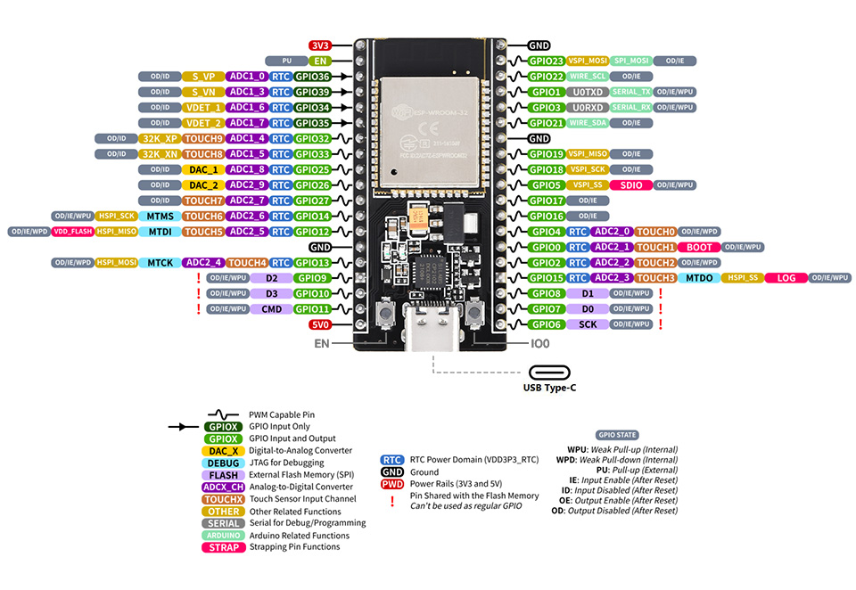

# ESP32 Nodemcu Setup:

## ESP32 Pinout:




## Setup:

### CH340 :  is a USB bus conversion chip on ESP32, it can realize USB to serial UART Interface

- Download that Driver:

``` link
https://sparks.gogo.co.nz/ch340.html
```

### Arduino IDE:

- Download the IDE:

``` link
https://www.arduino.cc/en/software
```

- Download esp32 board package:
 Open `File` then `Preference` then put those links in `Additional boards manager URLs`

``` link
https://dl.espressif.com/dl/package_esp32_index.json.
```

or

``` link
https://raw.githubusercontent.com/espressif/arduino-esp32/gh-pages/package_esp32_index.json
```

- Now Open `Board Manager` search for `Esp32` download esp32 by `Espressif Systems`
- Now Upload `Blink` sketch form file then Examples , Basics
- and HERE YOU GO

## IEEE Micromouse Sensors:

- [TOF_VL53L0X] ✅
- [MPU6050](./MPU6050/) ✅
- AS5600_encoder ❌
----
> Hardware Modules : [PDF](HardwareModules.pdf)

